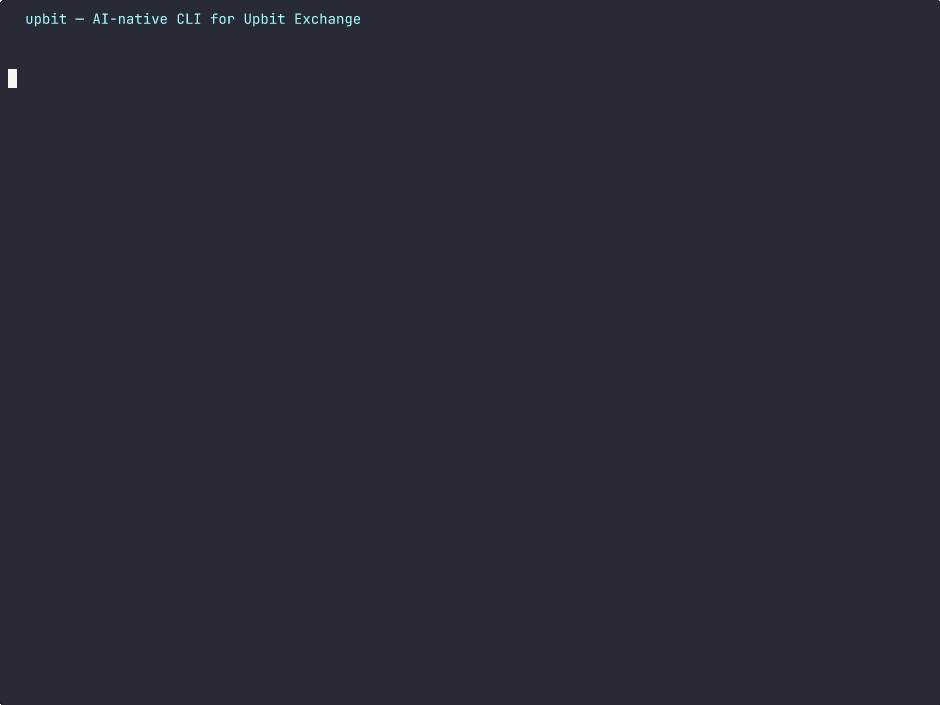

# upbit — AI 친화적 Upbit 거래소 CLI

[English](README.md)

> 사람과 AI 에이전트 모두를 위해 설계된 유일한 Upbit CLI.

[](https://go.dev)
[](https://pkg.go.dev/github.com/kyungw00k/upbit)
[](LICENSE)
[](https://github.com/kyungw00k/upbit/releases)

## 데모



## 설치

```bash
curl -sSL https://kyungw00k.dev/upbit/install.sh | sh    # 빠른 설치
brew install kyungw00k/cli/upbit                          # Homebrew
```

## Go 모듈

Go 프로젝트에서 Upbit API 클라이언트를 직접 사용할 수 있습니다:

```bash
go get github.com/kyungw00k/upbit
```

```go
package main

import (
	"context"
	"fmt"

	"github.com/kyungw00k/upbit/api"
	"github.com/kyungw00k/upbit/api/quotation"
	"github.com/kyungw00k/upbit/api/exchange"
)

func main() {
	// 공개 API (인증 불필요)
	client := api.NewClient("", "")
	q := quotation.NewQuotationClient(client)

	tickers, _ := q.GetTickers(context.Background(), []string{"KRW-BTC", "KRW-ETH"})
	for _, t := range tickers {
		fmt.Printf("%s: %v\n", t.Market, t.TradePrice)
	}

	// 인증 API
	authClient := api.NewClient("your-access-key", "your-secret-key")
	e := exchange.NewExchangeClient(authClient)

	accounts, _ := e.GetAccounts(context.Background())
	for _, a := range accounts {
		fmt.Printf("%s: %s\n", a.Currency, a.Balance)
	}
}
```

### 패키지

| 패키지 | Import 경로 | 설명 |
|--------|-------------|------|
| API 클라이언트 | `github.com/kyungw00k/upbit/api` | JWT 인증, Rate Limit, 자동 재시도 HTTP 클라이언트 |
| 시세 조회 | `github.com/kyungw00k/upbit/api/quotation` | 시세 데이터 (현재가, 캔들, 호가, 체결) |
| 거래 | `github.com/kyungw00k/upbit/api/exchange` | 거래 (잔고, 주문) |
| 입출금 | `github.com/kyungw00k/upbit/api/wallet` | 입금 및 출금 |
| WebSocket | `github.com/kyungw00k/upbit/api/websocket` | 자동 재연결 실시간 스트리밍 |
| 타입 | `github.com/kyungw00k/upbit/types` | 데이터 모델 (Ticker, Candle, Order 등) |

## 빠른 시작

```bash
upbit ticker KRW-BTC                           # 현재가 조회
upbit candle KRW-BTC -i 1d --from 2025-01-01   # 과거 캔들 (캐시 지원)
upbit watch candle KRW-BTC -i 1m               # 실시간 캔들스틱 차트 (TUI)

export UPBIT_ACCESS_KEY=... UPBIT_SECRET_KEY=...
upbit buy KRW-BTC -p 100000000 -V 0.001        # 지정가 매수
upbit balance                                   # 포트폴리오 (KRW 평가액)
```

## 주요 기능

**AI 퍼스트** — `upbit tool-schema`로 LLM/MCP 도구 호출용 JSON Schema 내보내기. Non-TTY 환경에서 자동 JSON 출력으로 AI 에이전트 파이프라인에 최적.

**실시간 TUI** — `watch ticker/orderbook/trade/candle`을 Bubble Tea 기반으로 제공. Tab 키로 복수 마켓 전환. ASCII 캔들스틱 차트와 거래량 패널.

**스마트 트레이딩** — 호가 단위 자동 보정으로 KRW/BTC/USDT 마켓 주문 실패 방지. 확인 프롬프트 제공 (`--force`로 스킵). 테스트 주문 (`--test`).

**캔들 캐시** — SQLite 캐시와 `--from` 자동 페이지네이션으로 전체 이력 조회. `upbit cache`로 확인, `--clear`로 삭제.

**다국어** — `LANG=ko_KR` → 한국어, 기본값 → 영어. POSIX 로케일 표준 (LC_ALL > LC_MESSAGES > LANG).

**자체 업데이트** — `upbit update`로 GitHub Releases에서 최신 버전 다운로드 (SHA256 검증). `--check`로 미리보기.

## 명령어

전체 목록은 `upbit --help`를 참고하세요. 주요 명령어:

| 카테고리 | 명령어 |
|---------|--------|
| 시세 | `ticker`, `candle`, `orderbook`, `trades`, `market`, `tick-size` |
| 거래 | `buy`, `sell`, `balance`, `order list/show/cancel/replace` |
| 입출금 | `wallet`, `deposit list/show/address`, `withdraw list/show/request` |
| 실시간 | `watch ticker/orderbook/trade/candle/my-order/my-asset` |
| 유틸리티 | `tool-schema`, `api-keys`, `cache`, `update` |

## 출력

```bash
upbit ticker KRW-BTC              # 테이블 (터미널)
upbit ticker KRW-BTC | jq .       # JSON (파이프, 자동)
upbit ticker KRW-BTC -o csv       # CSV
upbit ticker KRW-BTC --json price # 필드 선택
```

| 컨텍스트 | 기본값 | 변경 |
|---------|--------|------|
| 터미널 (TTY) | 정렬된 테이블 | `-o json`, `-o csv` |
| 파이프 (Non-TTY) | 압축 JSON | `-o table`, `-o jsonl` |

## 인증

API 키는 **환경변수에서만** 읽으며, 디스크에 저장하지 않습니다.

```bash
export UPBIT_ACCESS_KEY=your_access_key
export UPBIT_SECRET_KEY=your_secret_key
```

시세 조회 명령어는 인증 없이 사용할 수 있습니다.
거래, 입출금, 실시간 개인 스트림(`watch my-order`, `watch my-asset`)은 인증이 필요합니다.

## 실시간 TUI

Watch 명령은 [Bubble Tea](https://github.com/charmbracelet/bubbletea) 기반 전체 화면 터미널 UI를 제공합니다:

- **watch ticker** — 실시간 가격 테이블 (상승=초록, 하락=빨강)
- **watch orderbook** — 스프레드 중심 매수/매도 호가 차트
- **watch trade** — 체결 스트림 스크롤
- **watch candle** — ASCII 캔들스틱 차트 + 거래량 바

복수 마켓: Tab 또는 ←/→로 전환

```bash
upbit watch ticker KRW-BTC KRW-ETH KRW-XRP
upbit watch orderbook KRW-BTC
upbit watch candle KRW-BTC -i 1m
```

## 캔들 캐시

```bash
upbit candle KRW-BTC --from 2025-01-01   # 자동 페이지네이션 (SQLite 캐시)
upbit candle KRW-BTC --from 2025-01-01 --no-cache
upbit cache                               # 캐시 정보
upbit cache --clear                       # 캐시 삭제
```

## AI 에이전트 연동

AI 에이전트용 upbit 스킬 설치:

```bash
curl -sSL https://kyungw00k.dev/upbit/install-skill.sh | sh
```

`~/.agents/skills/upbit/` ([agentskills.io](https://agentskills.io))과 `.claude/skills/upbit/` (Claude Code) 양쪽에 설치됩니다.

### LLM 도구 호출용 스키마

```bash
upbit tool-schema          # 전체 명령 JSON Schema
upbit tool-schema buy      # 특정 명령 (응답 스키마 포함)
```

## 자체 업데이트

```bash
upbit update          # 최신 버전 다운로드 및 설치
upbit update --check  # 확인만 하고 다운로드하지 않음
```

단일 정적 바이너리, 런타임 의존성 없음. 크로스 플랫폼: Linux, macOS, Windows (amd64, arm64).

## 감사의 글

- 캔들스틱 차트는 [cli-candlestick-chart](https://github.com/Julien-R44/cli-candlestick-chart)에서 영감을 받았습니다

## 라이선스

MIT
