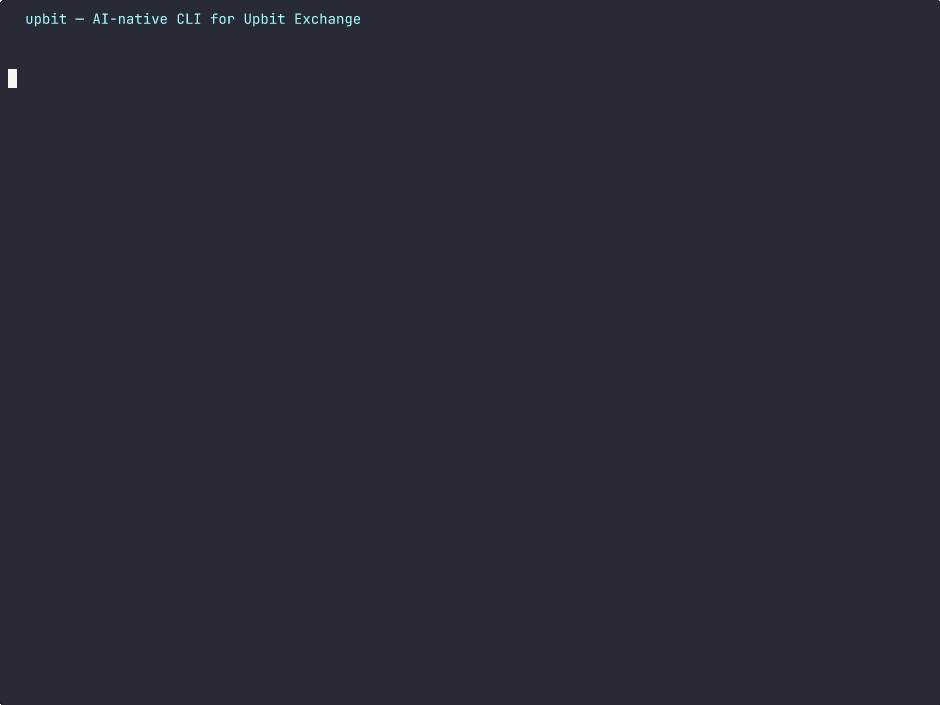

# upbit — AI-native CLI for Upbit Exchange

[한국어](README.ko.md)

> The only Upbit CLI designed for both humans and AI agents.

[](https://go.dev)
[](LICENSE)
[]()

## Quick Demo



## Why upbit?

### AI-First Design
- `upbit tool-schema` exports JSON Schema for LLM tool calling (OpenAI/MCP) — 35 commands covered
- Non-TTY auto-detects and outputs JSON — perfect for AI agent pipelines
- Structured error codes for programmatic error handling
- Designed to be used as an AI agent's tool alongside human terminal use

### Smart Trading
- Tick-size auto-correction prevents order failures across KRW/BTC/USDT markets
- SQLite candle cache with auto-pagination (`--from 2025-01-01` fetches all history)
- Market validation before WebSocket subscriptions
- Buy/sell confirmation prompts with `--force` for automation

### Multilingual
- `LANG=ko_KR` → Korean interface
- Default → English interface
- POSIX locale standard (LC_ALL > LC_MESSAGES > LANG)

### Self-contained
- Single static binary, zero runtime dependencies
- Self-update: `upbit update`
- Cross-platform: Linux, macOS, Windows (amd64, arm64)

## Installation

### From Release (recommended)

```bash
# macOS / Linux
curl -sSL https://github.com/kyungw00k/upbit/releases/latest/download/upbit_$(uname -s | tr '[:upper:]' '[:lower:]')_$(uname -m).tar.gz | tar xz
mv upbit ~/.local/bin/
```

### From Source

```bash
git clone https://github.com/kyungw00k/upbit.git
cd upbit
make install   # installs to ~/.local/bin/upbit
```

### Via Go

```bash
go install github.com/kyungw00k/upbit/cmd/upbit@latest
```

## Quick Start

```bash
# No auth required — market data
upbit ticker KRW-BTC
upbit candle KRW-BTC -i 1d -c 5

# Set API keys (env vars only — never stored on disk)
export UPBIT_ACCESS_KEY=your_key
export UPBIT_SECRET_KEY=your_secret

# Trading
upbit buy KRW-BTC -p 100000000 -V 0.001
upbit sell KRW-BTC -p 110000000 -V 0.001
upbit balance
```

## AI Integration

```bash
# Export all command schemas for LLM function calling
upbit tool-schema

# Export specific command schema
upbit tool-schema buy

# AI agents get JSON automatically (non-TTY)
upbit ticker KRW-BTC | jq '.trade_price'

# Force JSON in any context
upbit ticker KRW-BTC -o json

# Select specific fields
upbit ticker KRW-BTC --json market,trade_price,signed_change_rate
```

### Example: tool-schema output

```json
[
  {
    "name": "upbit_buy",
    "description": "Buy order",
    "parameters": {
      "type": "object",
      "properties": {
        "market": { "type": "string", "description": "Market code (e.g. KRW-BTC)" },
        "price": { "type": "string", "description": "Order price" },
        "volume": { "type": "string", "description": "Order volume" },
        "total": { "type": "string", "description": "Order total (market buy)" },
        "force": { "type": "boolean", "description": "Skip confirmation prompt" },
        "test": { "type": "boolean", "description": "Test order (no real execution)" }
      },
      "required": ["market"]
    }
  }
]
```

## Commands

### Market Data (no auth)

| Command | Description |
|---------|-------------|
| `ticker <market...>` | Current price |
| `candle <market>` | OHLCV candles |
| `orderbook <market...>` | Order book |
| `trades <market>` | Recent trades |
| `market` | List all markets |
| `tick-size <market...>` | Tick size info |
| `orderbook-levels <market...>` | Orderbook depth levels |

### Trading (auth required)

| Command | Description |
|---------|-------------|
| `buy <market>` | Buy order (`-p` price, `-V` volume, `-t` total) |
| `sell <market>` | Sell order |
| `balance [currency]` | Account balance with KRW evaluation |
| `order list` | Open/closed orders |
| `order show <uuid>` | Order details |
| `order cancel <uuid>` | Cancel order |
| `order replace <uuid>` | Modify order (cancel and re-order) |
| `order chance <market>` | Order constraints |

### Deposits & Withdrawals (auth required)

| Command | Description |
|---------|-------------|
| `wallet` | Wallet service status |
| `deposit list` | List deposits |
| `deposit show <uuid>` | Deposit details |
| `deposit address [currency]` | Deposit address |
| `deposit address create` | Generate new deposit address |
| `withdraw list` | List withdrawals |
| `withdraw show <uuid>` | Withdrawal details |
| `withdraw request` | Request withdrawal |
| `withdraw cancel <uuid>` | Cancel withdrawal |
| `travelrule vasps` | Travel rule supported exchanges |
| `travelrule verify-txid` | Verify by TxID |
| `travelrule verify-uuid` | Verify by UUID |

### Real-time (WebSocket)

| Command | Description |
|---------|-------------|
| `watch ticker <market...>` | Live price stream |
| `watch orderbook <market...>` | Live order book |
| `watch trade <market...>` | Live trades |
| `watch candle <market...>` | Live candles |
| `watch my-order` | My order events (auth) |
| `watch my-asset` | My asset changes (auth) |

### Utilities

| Command | Description |
|---------|-------------|
| `tool-schema [cmd]` | JSON Schema for LLM/MCP |
| `api-keys` | API key list |
| `cache` | Cache info / `--clear` |
| `update` | Self-update / `--check` |

## Output Formats

| Context | Default | Override |
|---------|---------|---------|
| Terminal (TTY) | Aligned table | `-o json`, `-o csv` |
| Pipe (non-TTY) | Compact JSON | `-o table`, `-o jsonl` |

```bash
upbit ticker KRW-BTC              # table (terminal)
upbit ticker KRW-BTC | jq .       # auto JSON (pipe)
upbit ticker KRW-BTC -o csv       # CSV
upbit ticker KRW-BTC --json price # selected fields
```

## Candle Cache

```bash
# Auto-paginate from date (cached in SQLite)
upbit candle KRW-BTC --from 2025-01-01

# Bypass cache
upbit candle KRW-BTC --from 2025-01-01 --no-cache

# Cache info and management
upbit cache
upbit cache --clear
```

## Authentication

API keys are read **only from environment variables** — never stored on disk.

```bash
export UPBIT_ACCESS_KEY=your_access_key
export UPBIT_SECRET_KEY=your_secret_key
```

Market data commands work without authentication. Trading, deposits/withdrawals, and personal WebSocket streams (`watch my-order`, `watch my-asset`) require authentication.

## License

MIT
