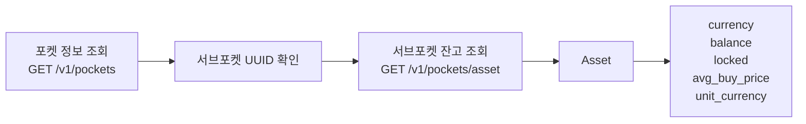

Fetch the complete documentation index at: https://docs.upbit.com/kr/llms.txt. Use this file to discover all available pages before exploring further. Append .md to any documentation page URL to get its markdown version.

# 서브포켓 잔고 조회

메인포켓의 API Key 권한을 사용하여 특정 서브포켓의 잔고를 개별 조회하는 API입니다.

### 서브포켓 잔고 조회 흐름

조회하고자하는 포켓 UUID는 <Anchor target="_blank" href="ref:list-pockets">포켓 정보 조회 API</Anchor>를 통해 확인할 수 있습니다.



<br />

<div className="APISectionHeader-heading4MUMLbp4_nLs">Rate Limit</div>

<div className="box-rate-limit">

초당 최대 30회 호출할 수 있습니다. 포켓 단위로 측정되며 \[Exchange 기본 그룹] 내에서 요청 가능 횟수를 공유합니다. Rate Limit은 요청 처리량을 보장하는 기준이 아니며, 트래픽 상황이나 서비스 안정성 확보 필요에 따라 제한 또는 조정될 수 있습니다.

</div>

<br />

<div className="APISectionHeader-heading4MUMLbp4_nLs">API Key Permission</div>

<div className="box-rate-limit">
  <a href="auth">인증</a>이 필요한 API로, 메인포켓만 사용 가능합니다.
  <br />

메인포켓 키발급 페이지에서 \[포켓관리] 권한이 설정된 API Key를 사용해야 합니다. <br />

권한 오류(out\_of\_scope) 오류가 발생한다면, <a href="https://upbit.com/mypage/open_api_management">API Key 관리 메뉴</a>에서 권한 설정을 확인해주세요.

</div>

<br />

# OpenAPI definition

```json
{
  "openapi": "3.0.2",
  "info": {
    "title": "EXCHANGE API",
    "version": "1.0.0"
  },
  "servers": [
    {
      "url": "https://api.upbit.com"
    }
  ],
  "components": {
    "schemas": {
      "PocketBalance": {
        "type": "object",
        "required": [
          "currency",
          "balance",
          "locked",
          "avg_buy_price",
          "avg_buy_price_modified",
          "unit_currency"
        ],
        "properties": {
          "currency": {
            "type": "string",
            "description": "보유 자산의 통화 코드.\n\n[예시] KRW, BTC, ETH\n",
            "example": "BTC"
          },
          "balance": {
            "type": "string",
            "format": "decimal",
            "description": "주문 가능한 수량 또는 금액.\n\n* 디지털 자산: 수량 단위\n* 법정 통화(KRW): 금액 단위\n",
            "example": "2.0"
          },
          "locked": {
            "type": "string",
            "format": "decimal",
            "description": "출금 또는 주문 체결 대기 등으로 인해 묶여 있는 잠긴 잔액",
            "example": "0.0"
          },
          "avg_buy_price": {
            "type": "string",
            "format": "decimal",
            "description": "해당 자산의 매수 평균가",
            "example": "140000000"
          },
          "avg_buy_price_modified": {
            "type": "boolean",
            "description": "매수 평균가 수정 여부",
            "example": false
          },
          "unit_currency": {
            "type": "string",
            "description": "매수 평균가(avg_buy_price)의 기준이 되는 통화 단위.\n\n[예시] KRW, BTC, USDT\n",
            "example": "KRW"
          }
        }
      },
      "Error": {
        "type": "object",
        "properties": {
          "error": {
            "type": "object",
            "required": [
              "name",
              "message"
            ],
            "properties": {
              "name": {
                "type": "string",
                "description": "에러명"
              },
              "message": {
                "type": "string",
                "description": "에러 메세지"
              }
            }
          }
        }
      }
    }
  },
  "x-readme": {
    "explorer-enabled": false,
    "samples-languages": [
      "shell",
      "python",
      "java",
      "node"
    ]
  },
  "paths": {
    "/v1/pockets/assets": {
      "get": {
        "operationId": "get-sub-pocket-balance",
        "summary": "서브포켓 잔고 조회",
        "description": "메인포켓의 API Key 권한을 사용하여 특정 서브포켓의 잔고를 개별 조회하는 API입니다.",
        "tags": [
          "Exchange"
        ],
        "x-readme": {
          "code-samples": [
            {
              "language": "curl",
              "code": "curl --request GET \\\n  --url 'https://api.upbit.com/v1/pockets/assets?uuid=9ca023a5-851b-4fec-9f0a-48cd83c2eaae' \\\n  --header 'Authorization: Bearer {JWT_TOKEN}' \\\n  --header 'Accept: application/json'\n"
            },
            {
              "language": "python",
              "install": "pip install requests pyjwt python-dotenv",
              "code": "import requests\n\nBASE_URL = \"https://api.upbit.com\"\nPATH = \"/v1/pockets/assets\"\nparams = {\"uuid\": \"9ca023a5-851b-4fec-9f0a-48cd83c2eaae\"}\nheaders = {\n  \"Authorization\": \"Bearer {JWT_TOKEN}\",\n  \"Accept\": \"application/json\",\n}\n\nres = requests.get(f\"{BASE_URL}{PATH}\", headers=headers, params=params)\nprint(res.json())\n"
            },
            {
              "language": "node",
              "name": "Axios",
              "install": "npm install axios",
              "code": "const axios = require(\"axios\");\n\naxios.request({\n  method: \"GET\",\n  url: \"https://api.upbit.com/v1/pockets/assets\",\n  params: { uuid: \"9ca023a5-851b-4fec-9f0a-48cd83c2eaae\" },\n  headers: {\n    Authorization: \"Bearer {JWT_TOKEN}\",\n    Accept: \"application/json\",\n  },\n}).then((response) => console.log(response.data));\n"
            },
            {
              "language": "java",
              "code": "import java.io.IOException;\nimport okhttp3.HttpUrl;\nimport okhttp3.OkHttpClient;\nimport okhttp3.Request;\nimport okhttp3.Response;\n\npublic class ListPocketBalances {\n    public static void main(String[] args) throws IOException {\n        HttpUrl url = HttpUrl.parse(\"https://api.upbit.com/v1/pockets/assets\").newBuilder()\n            .addQueryParameter(\"uuid\", \"9ca023a5-851b-4fec-9f0a-48cd83c2eaae\")\n            .build();\n        OkHttpClient client = new OkHttpClient();\n        Request request = new Request.Builder()\n            .url(url)\n            .get()\n            .addHeader(\"Authorization\", \"Bearer {JWT_TOKEN}\")\n            .addHeader(\"Accept\", \"application/json\")\n            .build();\n        try (Response response = client.newCall(request).execute()) {\n            System.out.println(response.body().string());\n        }\n    }\n}\n"
            }
          ]
        },
        "parameters": [
          {
            "name": "uuid",
            "in": "query",
            "required": true,
            "schema": {
              "type": "string",
              "description": "조회하고자 하는 서브포켓의 UUID"
            },
            "allowReserved": true,
            "examples": {
              "default": {
                "value": "9ca023a5-851b-4fec-9f0a-48cd83c2eaae"
              }
            }
          }
        ],
        "responses": {
          "200": {
            "description": "List of pocket balances",
            "content": {
              "application/json": {
                "schema": {
                  "type": "array",
                  "items": {
                    "$ref": "#/components/schemas/PocketBalance"
                  }
                },
                "examples": {
                  "Successful Example": {
                    "value": [
                      {
                        "currency": "KRW",
                        "balance": "1000000.0",
                        "locked": "0.0",
                        "avg_buy_price": "0",
                        "avg_buy_price_modified": false,
                        "unit_currency": "KRW"
                      },
                      {
                        "currency": "BTC",
                        "balance": "2.0",
                        "locked": "0.0",
                        "avg_buy_price": "140000000",
                        "avg_buy_price_modified": false,
                        "unit_currency": "KRW"
                      }
                    ]
                  }
                }
              }
            }
          },
          "400": {
            "description": "error object",
            "content": {
              "application/json": {
                "schema": {
                  "$ref": "#/components/schemas/Error"
                },
                "examples": {
                  "invalid parameter error": {
                    "value": {
                      "error": {
                        "name": "invalid_parameter",
                        "message": "잘못된 파라미터입니다."
                      }
                    }
                  }
                }
              }
            }
          },
          "403": {
            "description": "error object",
            "content": {
              "application/json": {
                "schema": {
                  "$ref": "#/components/schemas/Error"
                },
                "examples": {
                  "out of scope error": {
                    "value": {
                      "error": {
                        "name": "out_of_scope",
                        "message": "권한이 부족합니다."
                      }
                    }
                  }
                }
              }
            }
          },
          "404": {
            "description": "error object",
            "content": {
              "application/json": {
                "schema": {
                  "$ref": "#/components/schemas/Error"
                },
                "examples": {
                  "pocket not found error": {
                    "value": {
                      "error": {
                        "name": "pocket_not_found",
                        "message": "포켓을 찾지 못했습니다."
                      }
                    }
                  }
                }
              }
            }
          }
        }
      }
    }
  }
}
```

# Sibling pages

* [포켓 정보 조회](https://docs.upbit.com/kr/reference/list-pockets.md)
* [포켓별 API Key 목록 조회](https://docs.upbit.com/kr/reference/list-pocket-api-keys.md)
* [메인포켓 자산 이전](https://docs.upbit.com/kr/reference/universal-transfer.md)
* [메인포켓 자산 이전 목록 조회](https://docs.upbit.com/kr/reference/list-universal-transfers.md)
* [서브포켓 자산 이전](https://docs.upbit.com/kr/reference/transfer.md)
* [서브포켓 자산 이전 목록 조회](https://docs.upbit.com/kr/reference/list-transfers.md)