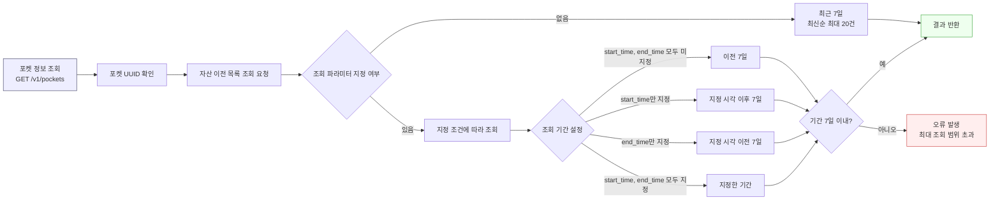

Fetch the complete documentation index at: https://docs.upbit.com/kr/llms.txt. Use this file to discover all available pages before exploring further. Append .md to any documentation page URL to get its markdown version.

# 메인포켓 자산 이전 목록 조회

메인포켓의 API Key 권한을 사용하여 포켓 간(메인포켓 ↔ 서브포켓 등) 자산 이전 내역을 조회하는 API입니다.

### 메인포켓 자산 이전 목록 조회 가능 범위

본 API는 **메인포켓의 API Key 권한**을 사용하여 포켓 간 자산 이전 내역을 조회하는 API입니다.<br />메인포켓 ↔ 서브포켓 간 이전 내역은 물론, 서브포켓 간 이전 내역도 조회할 수 있습니다.<br />조회하고자하는 포켓 UUID는 <Anchor target="_blank" href="ref:list-pockets">포켓 정보 조회 API</Anchor>를 통해 확인할 수 있습니다.



<br />

### 조회 기준 및 제약 사항

#### 1. 기본 조회 조건

쿼리 파라미터를 별도로 지정하지 않으면, 기본 정책에 따라 **최근 7일 이내의 이전 내역 중 최신순으로 최대 20건**을 조회합니다.

#### 2. 조회 기간 설정

`start_time`과 `end_time`을 사용하여 특정 기간의 이전 내역만 조회할 수 있습니다.

* `start_time`과 `end_time`을 모두 지정하지 않은 경우 요청 시점을 기준으로 이전 7일간의 내역을 조회합니다.
* `start_time`만 지정한 경우 지정한 시각부터 이후 7일간의 내역을 조회합니다.
* `end_time`만 지정한 경우 지정한 시각을 기준으로 이전 7일간의 내역을 조회합니다.

#### 3. 조회 범위 제한

`start_time`과 `end_time` 사이의 전체 기간은 **최대 7일**을 초과할 수 없습니다. 7일을 초과하는 경우에는 **허용 범위 초과 오류**가 발생합니다.

#### 4. 데이터 누락 방지

조회 기간 내 데이터가 많아 `limit`을 초과하는 경우, 한 번에 모두 반환되지 않을 수 있습니다. 전체 내역을 안전하게 수집하려면 기간을 나누어 분할 조회하는 것이 좋습니다.

#### 5. 일시 형식

`start_time`과 `end_time`은 다음 형식 중 하나로 입력해야 합니다.

* ISO 8601 형식: `2025-06-24T04:56:53Z`, `2025-06-24T13:56:53+09:00`
* 밀리초 타임스탬프(UTC 기준): `1750741013000`&#x20;

<br />

<div className="APISectionHeader-heading4MUMLbp4_nLs">Rate Limit</div>

<div className="box-rate-limit">

초당 최대 30회 호출할 수 있습니다. 포켓 단위로 측정되며 \[Exchange 기본 그룹] 내에서 요청 가능 횟수를 공유합니다. Rate Limit은 요청 처리량을 보장하는 기준이 아니며, 트래픽 상황이나 서비스 안정성 확보 필요에 따라 제한 또는 조정될 수 있습니다.

</div>

<br />

<div className="APISectionHeader-heading4MUMLbp4_nLs">API Key Permission</div>

<div className="box-rate-limit">
  <a href="auth">인증</a>이 필요한 API로, 메인포켓만 사용 가능합니다.
  <br />

메인포켓 키발급 페이지에서 \[포켓관리] 권한이 설정된 API Key를 사용해야 합니다. <br />

권한 오류(out\_of\_scope) 오류가 발생한다면, <a href="https://upbit.com/mypage/open_api_management">API Key 관리 메뉴</a>에서 권한 설정을 확인해주세요.

</div>

<br />

# OpenAPI definition

```json
{
  "openapi": "3.0.2",
  "info": {
    "title": "EXCHANGE API",
    "version": "1.0.0"
  },
  "servers": [
    {
      "url": "https://api.upbit.com"
    }
  ],
  "components": {
    "schemas": {
      "PocketTransferState": {
        "type": "string",
        "enum": [
          "submitted",
          "processing",
          "done",
          "failed"
        ],
        "description": "자산 이전 요청 상태.\n\n* `submitted`: 접수됨\n* `processing`: 처리 중\n* `done`: 완료\n* `failed`: 실패\n",
        "example": "processing"
      },
      "PocketTransfer": {
        "type": "object",
        "required": [
          "uuid",
          "identifier",
          "from",
          "to",
          "state",
          "currency",
          "amount",
          "created_at"
        ],
        "properties": {
          "uuid": {
            "type": "string",
            "description": "자산 이전 요청을 식별하는 UUID",
            "example": "9ca023a5-851b-4fec-9f0a-48cd83c2eaae"
          },
          "identifier": {
            "type": "string",
            "nullable": true,
            "description": "자산 이전 요청 시 클라이언트가 지정한 식별자.\n지정하지 않을 경우 null을 반환합니다.\n",
            "example": "unique_transfer_id_20260531_01"
          },
          "from": {
            "type": "string",
            "description": "자산을 보낸 포켓의 UUID",
            "example": "9ca023a5-851b-4fec-9f0a-48cd83c2eaae"
          },
          "to": {
            "type": "string",
            "description": "자산을 받은 포켓의 UUID",
            "example": "9ca023a5-851b-4fec-9f0a-48cd83c2eaae"
          },
          "state": {
            "$ref": "#/components/schemas/PocketTransferState"
          },
          "currency": {
            "type": "string",
            "description": "이전된 자산 코드.\n\n[예시] KRW, BTC, ETH\n",
            "example": "XRP"
          },
          "amount": {
            "type": "string",
            "format": "decimal",
            "description": "이전된 자산 수량",
            "example": "10.00"
          },
          "created_at": {
            "type": "string",
            "description": "요청 생성 시각",
            "example": "2026-05-28T15:17:51+09:00"
          }
        }
      },
      "Error": {
        "type": "object",
        "properties": {
          "error": {
            "type": "object",
            "required": [
              "name",
              "message"
            ],
            "properties": {
              "name": {
                "type": "string",
                "description": "에러명"
              },
              "message": {
                "type": "string",
                "description": "에러 메세지"
              }
            }
          }
        }
      }
    }
  },
  "x-readme": {
    "explorer-enabled": false,
    "samples-languages": [
      "shell",
      "python",
      "java",
      "node"
    ]
  },
  "paths": {
    "/v1/pockets/universal_transfers": {
      "get": {
        "operationId": "list-universal-transfers",
        "summary": "메인포켓 자산 이전 목록 조회",
        "description": "메인포켓의 API Key 권한을 사용하여 포켓 간(메인포켓 ↔ 서브포켓 등) 자산 이전 내역을 조회하는 API입니다.",
        "tags": [
          "Exchange"
        ],
        "x-readme": {
          "code-samples": [
            {
              "language": "curl",
              "code": "curl --request GET \\\n  --url 'https://api.upbit.com/v1/pockets/universal_transfers?states[]=processing&states[]=done&currency=XRP&limit=2' \\\n  --header 'Authorization: Bearer {JWT_TOKEN}' \\\n  --header 'Accept: application/json'\n"
            },
            {
              "language": "python",
              "install": "pip install requests pyjwt python-dotenv",
              "code": "import requests\n\nBASE_URL = \"https://api.upbit.com\"\nPATH = \"/v1/pockets/universal_transfers\"\nparams = [(\"states[]\", \"processing\"), (\"states[]\", \"done\"), (\"currency\", \"XRP\"), (\"limit\", 2)]\nheaders = {\n  \"Authorization\": \"Bearer {JWT_TOKEN}\",\n  \"Accept\": \"application/json\",\n}\n\nres = requests.get(f\"{BASE_URL}{PATH}\", headers=headers, params=params)\nprint(res.json())\n"
            },
            {
              "language": "node",
              "name": "Axios",
              "install": "npm install axios",
              "code": "const axios = require(\"axios\");\n\naxios.request({\n  method: \"GET\",\n  url: \"https://api.upbit.com/v1/pockets/universal_transfers\",\n  params: new URLSearchParams([\n    [\"states[]\", \"processing\"],\n    [\"states[]\", \"done\"],\n    [\"currency\", \"XRP\"],\n    [\"limit\", \"2\"],\n  ]),\n  headers: {\n    Authorization: \"Bearer {JWT_TOKEN}\",\n    Accept: \"application/json\",\n  },\n}).then((response) => console.log(response.data));\n"
            },
            {
              "language": "java",
              "code": "import java.io.IOException;\nimport okhttp3.HttpUrl;\nimport okhttp3.OkHttpClient;\nimport okhttp3.Request;\nimport okhttp3.Response;\n\npublic class ListUniversalTransfers {\n    public static void main(String[] args) throws IOException {\n        HttpUrl url = HttpUrl.parse(\"https://api.upbit.com/v1/pockets/universal_transfers\").newBuilder()\n            .addQueryParameter(\"states[]\", \"processing\")\n            .addQueryParameter(\"states[]\", \"done\")\n            .addQueryParameter(\"currency\", \"XRP\")\n            .addQueryParameter(\"limit\", \"2\")\n            .build();\n        OkHttpClient client = new OkHttpClient();\n        Request request = new Request.Builder()\n            .url(url)\n            .get()\n            .addHeader(\"Authorization\", \"Bearer {JWT_TOKEN}\")\n            .addHeader(\"Accept\", \"application/json\")\n            .build();\n        try (Response response = client.newCall(request).execute()) {\n            System.out.println(response.body().string());\n        }\n    }\n}\n"
            }
          ]
        },
        "parameters": [
          {
            "name": "from",
            "in": "query",
            "required": false,
            "schema": {
              "type": "string",
              "description": "자산을 보낸 포켓의 UUID"
            },
            "allowReserved": true
          },
          {
            "name": "to",
            "in": "query",
            "required": false,
            "schema": {
              "type": "string",
              "description": "자산을 받은 포켓의 UUID"
            },
            "allowReserved": true
          },
          {
            "name": "states[]",
            "in": "query",
            "required": false,
            "schema": {
              "type": "array",
              "description": "자산 이전 요청 상태.\n지정한 상태의 이전 내역만 조회합니다. 미지정 시 모든 상태의 내역을 반환합니다.\n\n[예시] states[]=done&states[]=failed\n",
              "items": {
                "$ref": "#/components/schemas/PocketTransferState"
              }
            },
            "allowReserved": true,
            "examples": {
              "default": {
                "value": [
                  "processing",
                  "done"
                ]
              }
            }
          },
          {
            "name": "uuids[]",
            "in": "query",
            "required": false,
            "schema": {
              "type": "array",
              "description": "자산 이전 요청을 식별하는 UUID 목록.\n지정한 UUID에 해당하는 자산 이전 내역만 반환합니다.\n\n[예시] uuids[]=uuid1&uuids[]=uuid2\n\n제한사항: 최대 20개까지 조회 가능\n",
              "items": {
                "type": "string"
              }
            },
            "allowReserved": true
          },
          {
            "name": "identifiers[]",
            "in": "query",
            "required": false,
            "schema": {
              "type": "array",
              "description": "클라이언트가 요청 시 지정한 식별자 목록.\n\n[예시] identifiers[]=id1&identifiers[]=id2\n\n제한사항: 최대 20개까지 조회 가능\n",
              "items": {
                "type": "string"
              }
            },
            "allowReserved": true
          },
          {
            "name": "start_time",
            "in": "query",
            "required": false,
            "schema": {
              "type": "string",
              "description": "조회 기간의 시작 시각.\n지정한 시각부터 end_time까지 생성된 내역을 조회합니다.\n\n허용 규격: ISO 8601(타임존 포함) 또는 밀리초 타임스탬프\n"
            },
            "allowReserved": true
          },
          {
            "name": "end_time",
            "in": "query",
            "required": false,
            "schema": {
              "type": "string",
              "description": "조회 기간의 종료 시각.\nstart_time부터 지정한 시각까지 생성된 내역을 조회합니다.\n\n기본값: 현재 시각\n제한 사항: 최대 조회 범위 7일\n허용 규격: ISO 8601(타임존 포함) 또는 밀리초 타임스탬프\n"
            },
            "allowReserved": true
          },
          {
            "name": "currency",
            "in": "query",
            "required": false,
            "schema": {
              "type": "string",
              "description": "조회하고자 하는 자산의 코드",
              "example": "XRP"
            },
            "allowReserved": true,
            "examples": {
              "default": {
                "value": "XRP"
              }
            }
          },
          {
            "name": "limit",
            "in": "query",
            "required": false,
            "schema": {
              "type": "integer",
              "description": "요청 개수(기본값 20, 최대 100)",
              "default": 20,
              "example": 2
            },
            "allowReserved": true,
            "examples": {
              "default": {
                "value": 2
              }
            }
          },
          {
            "name": "order_by",
            "in": "query",
            "required": false,
            "schema": {
              "type": "string",
              "enum": [
                "asc",
                "desc"
              ],
              "description": "결과 정렬 방식. asc(오래된 순), desc(최신순)",
              "default": "desc",
              "example": "desc"
            },
            "allowReserved": true
          }
        ],
        "responses": {
          "200": {
            "description": "List of universal pocket transfers",
            "content": {
              "application/json": {
                "schema": {
                  "type": "array",
                  "items": {
                    "$ref": "#/components/schemas/PocketTransfer"
                  }
                },
                "examples": {
                  "Successful Example": {
                    "value": [
                      {
                        "from": "9ca023a5-851b-4fec-9f0a-48cd83c2eaae",
                        "to": "9ca023a5-851b-4fec-9f0a-48cd83c2eaae",
                        "uuid": "9ca023a5-851b-4fec-9f0a-48cd83c2eaae",
                        "identifier": "client_made_id_123",
                        "state": "processing",
                        "currency": "XRP",
                        "amount": "150.00",
                        "created_at": "2026-05-29T11:20:10+09:00"
                      }
                    ]
                  }
                }
              }
            }
          },
          "400": {
            "description": "error object",
            "content": {
              "application/json": {
                "schema": {
                  "$ref": "#/components/schemas/Error"
                }
              }
            }
          },
          "403": {
            "description": "error object",
            "content": {
              "application/json": {
                "schema": {
                  "$ref": "#/components/schemas/Error"
                }
              }
            }
          },
          "404": {
            "description": "error object",
            "content": {
              "application/json": {
                "schema": {
                  "$ref": "#/components/schemas/Error"
                }
              }
            }
          }
        }
      }
    }
  }
}
```

# Sibling pages

* [포켓 정보 조회](https://docs.upbit.com/kr/reference/list-pockets.md)
* [포켓별 API Key 목록 조회](https://docs.upbit.com/kr/reference/list-pocket-api-keys.md)
* [서브포켓 잔고 조회](https://docs.upbit.com/kr/reference/get-sub-pocket-balance.md)
* [메인포켓 자산 이전](https://docs.upbit.com/kr/reference/universal-transfer.md)
* [서브포켓 자산 이전](https://docs.upbit.com/kr/reference/transfer.md)
* [서브포켓 자산 이전 목록 조회](https://docs.upbit.com/kr/reference/list-transfers.md)