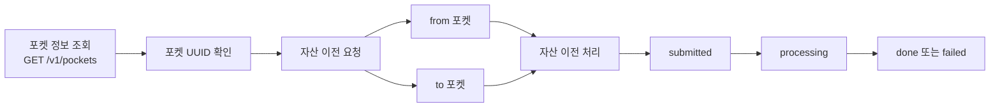

Fetch the complete documentation index at: https://docs.upbit.com/kr/llms.txt. Use this file to discover all available pages before exploring further. Append .md to any documentation page URL to get its markdown version.

# 메인포켓 자산 이전

메인포켓의 API Key 권한을 사용하여 포켓 간(메인포켓 ↔ 서브포켓 등) 자산 이전을 요청하는 API입니다.

### 메인포켓 자산 이전 가능 범위

메인포켓의 API Key를 사용하여 다음과 같은 자산 이전을 요청할 수 있습니다. 조회하고자하는 포켓 UUID는 <Anchor target="_blank" href="ref:list-pockets">포켓 정보 조회 API</Anchor>를 통해 확인할 수 있습니다.

* **메인포켓 → 서브포켓 :&#x20;**&#xBA54;인포켓의 자산을 서브포켓으로 이전

* **서브포켓 → 메인포켓  :&#x20;**&#xC11C;브포켓의 자산을 메인포켓으로 이전

* **서브포켓 →서브포켓 :&#x20;**&#xC11C;로 다른 서브포켓 간 자산 이전


<br />

#### 메인포켓 자산 이전 흐름 예시



<br />

### 유의사항

* 동일한 포켓 간 자산 이전은 지원하지 않습니다. (`from != to`)
* 자산 이전 요청에는 고유한 `identifier`를 사용할 수 있습니다.
* `identifier`는 성공 또는 실패 여부와 관계없이 한 번만 사용할 수 있으며, 이미 사용된 값은 재사용할 수 없습니다.
* `identifier` 지정 시 허용규격은  1\~64자 내의 문자, 숫자, 언더스코어(\_), 점(.), 하이픈(-) 입니다.
* `from`을 지정하지 않으면 현재 요청에 사용한 API Key가 속한 포켓 UUID가 기본값으로 사용됩니다.

<br />

### 상태(State)

자산 이전 요청은 다음 상태 중 하나를 가집니다.

| 상태           | 설명    |
| ------------ | ----- |
| `submitted`  | 요청 접수 |
| `processing` | 처리 중  |
| `done`       | 처리 완료 |
| `failed`     | 처리 실패 |

<br />

<br />

<div className="APISectionHeader-heading4MUMLbp4_nLs">Rate Limit</div>

<div className="box-rate-limit">

초당 최대 30회 호출할 수 있습니다. 포켓 단위로 측정되며 \[Exchange 기본 그룹] 내에서 요청 가능 횟수를 공유합니다. Rate Limit은 요청 처리량을 보장하는 기준이 아니며, 트래픽 상황이나 서비스 안정성 확보 필요에 따라 제한 또는 조정될 수 있습니다.

</div>

<br />

<div className="APISectionHeader-heading4MUMLbp4_nLs">API Key Permission</div>

<div className="box-rate-limit">
  <a href="auth">인증</a>이 필요한 API로, 메인포켓만 사용 가능합니다.
  <br />

메인포켓 키발급 페이지에서 \[포켓관리] 권한이 설정된 API Key를 사용해야 합니다. <br />

권한 오류(out\_of\_scope) 오류가 발생한다면, <a href="https://upbit.com/mypage/open_api_management">API Key 관리 메뉴</a>에서 권한 설정을 확인해주세요.

</div>

<br />

# OpenAPI definition

```json
{
  "openapi": "3.0.2",
  "info": {
    "title": "EXCHANGE API",
    "version": "1.0.0"
  },
  "servers": [
    {
      "url": "https://api.upbit.com"
    }
  ],
  "components": {
    "schemas": {
      "PocketTransferState": {
        "type": "string",
        "enum": [
          "submitted",
          "processing",
          "done",
          "failed"
        ],
        "description": "자산 이전 요청 상태.\n\n* `submitted`: 접수됨\n* `processing`: 처리 중\n* `done`: 완료\n* `failed`: 실패\n",
        "example": "processing"
      },
      "PocketTransfer": {
        "type": "object",
        "required": [
          "uuid",
          "identifier",
          "from",
          "to",
          "state",
          "currency",
          "amount",
          "created_at"
        ],
        "properties": {
          "uuid": {
            "type": "string",
            "description": "자산 이전 요청을 식별하는 UUID",
            "example": "9ca023a5-851b-4fec-9f0a-48cd83c2eaae"
          },
          "identifier": {
            "type": "string",
            "nullable": true,
            "description": "자산 이전 요청 시 클라이언트가 지정한 식별자.\n지정하지 않을 경우 null을 반환합니다.\n",
            "example": "unique_transfer_id_20260531_01"
          },
          "from": {
            "type": "string",
            "description": "자산을 보낸 포켓의 UUID",
            "example": "9ca023a5-851b-4fec-9f0a-48cd83c2eaae"
          },
          "to": {
            "type": "string",
            "description": "자산을 받은 포켓의 UUID",
            "example": "9ca023a5-851b-4fec-9f0a-48cd83c2eaae"
          },
          "state": {
            "$ref": "#/components/schemas/PocketTransferState"
          },
          "currency": {
            "type": "string",
            "description": "이전된 자산 코드.\n\n[예시] KRW, BTC, ETH\n",
            "example": "XRP"
          },
          "amount": {
            "type": "string",
            "format": "decimal",
            "description": "이전된 자산 수량",
            "example": "10.00"
          },
          "created_at": {
            "type": "string",
            "description": "요청 생성 시각",
            "example": "2026-05-28T15:17:51+09:00"
          }
        }
      },
      "Error": {
        "type": "object",
        "properties": {
          "error": {
            "type": "object",
            "required": [
              "name",
              "message"
            ],
            "properties": {
              "name": {
                "type": "string",
                "description": "에러명"
              },
              "message": {
                "type": "string",
                "description": "에러 메세지"
              }
            }
          }
        }
      }
    }
  },
  "x-readme": {
    "explorer-enabled": false,
    "samples-languages": [
      "shell",
      "python",
      "java",
      "node"
    ]
  },
  "paths": {
    "/v1/pockets/universal_transfers": {
      "post": {
        "operationId": "universal-transfer",
        "summary": "메인포켓 자산 이전",
        "description": "메인포켓의 API Key 권한을 사용하여 포켓 간(메인포켓 ↔ 서브포켓 등) 자산 이전을 요청하는 API입니다.",
        "tags": [
          "Exchange"
        ],
        "x-readme": {
          "code-samples": [
            {
              "language": "curl",
              "code": "curl --request POST \\\n  --url 'https://api.upbit.com/v1/pockets/universal_transfers' \\\n  --header 'Authorization: Bearer {JWT_TOKEN}' \\\n  --header 'Content-Type: application/json' \\\n  --header 'Accept: application/json' \\\n  --data '{\"from\":\"9ca023a5-851b-4fec-9f0a-48cd83c2eaae\",\"to\":\"9ca023a5-851b-4fec-9f0a-48cd83c2eaae\",\"currency\":\"XRP\",\"amount\":\"10.00\",\"identifier\":\"unique_transfer_id_20260531_01\"}'\n"
            },
            {
              "language": "python",
              "install": "pip install requests pyjwt python-dotenv",
              "code": "import requests\n\nBASE_URL = \"https://api.upbit.com\"\nPATH = \"/v1/pockets/universal_transfers\"\ndata = {\n  \"from\": \"9ca023a5-851b-4fec-9f0a-48cd83c2eaae\",\n  \"to\": \"9ca023a5-851b-4fec-9f0a-48cd83c2eaae\",\n  \"currency\": \"XRP\",\n  \"amount\": \"10.00\",\n  \"identifier\": \"unique_transfer_id_20260531_01\",\n}\nheaders = {\n  \"Authorization\": \"Bearer {JWT_TOKEN}\",\n  \"Content-Type\": \"application/json\",\n  \"Accept\": \"application/json\",\n}\n\nres = requests.post(f\"{BASE_URL}{PATH}\", headers=headers, json=data)\nprint(res.json())\n"
            },
            {
              "language": "node",
              "name": "Axios",
              "install": "npm install axios",
              "code": "const axios = require(\"axios\");\n\naxios.request({\n  method: \"POST\",\n  url: \"https://api.upbit.com/v1/pockets/universal_transfers\",\n  data: {\n    from: \"9ca023a5-851b-4fec-9f0a-48cd83c2eaae\",\n    to: \"9ca023a5-851b-4fec-9f0a-48cd83c2eaae\",\n    currency: \"XRP\",\n    amount: \"10.00\",\n    identifier: \"unique_transfer_id_20260531_01\",\n  },\n  headers: {\n    Authorization: \"Bearer {JWT_TOKEN}\",\n    \"Content-Type\": \"application/json\",\n    Accept: \"application/json\",\n  },\n}).then((response) => console.log(response.data));\n"
            },
            {
              "language": "java",
              "code": "import java.io.IOException;\nimport okhttp3.MediaType;\nimport okhttp3.OkHttpClient;\nimport okhttp3.Request;\nimport okhttp3.RequestBody;\nimport okhttp3.Response;\n\npublic class UniversalTransfer {\n    public static void main(String[] args) throws IOException {\n        String json = \"{\\\"from\\\":\\\"9ca023a5-851b-4fec-9f0a-48cd83c2eaae\\\",\\\"to\\\":\\\"9ca023a5-851b-4fec-9f0a-48cd83c2eaae\\\",\\\"currency\\\":\\\"XRP\\\",\\\"amount\\\":\\\"10.00\\\",\\\"identifier\\\":\\\"unique_transfer_id_20260531_01\\\"}\";\n        OkHttpClient client = new OkHttpClient();\n        Request request = new Request.Builder()\n            .url(\"https://api.upbit.com/v1/pockets/universal_transfers\")\n            .post(RequestBody.create(json, MediaType.parse(\"application/json\")))\n            .addHeader(\"Authorization\", \"Bearer {JWT_TOKEN}\")\n            .addHeader(\"Accept\", \"application/json\")\n            .build();\n        try (Response response = client.newCall(request).execute()) {\n            System.out.println(response.body().string());\n        }\n    }\n}\n"
            }
          ]
        },
        "requestBody": {
          "content": {
            "application/json": {
              "schema": {
                "type": "object",
                "required": [
                  "to",
                  "currency",
                  "amount"
                ],
                "properties": {
                  "from": {
                    "type": "string",
                    "description": "보내는 포켓의 UUID.\n미입력 시 현재 요청에 사용한 API Key 소속 포켓이 기본값으로 지정됩니다.\n",
                    "example": "9ca023a5-851b-4fec-9f0a-48cd83c2eaae"
                  },
                  "to": {
                    "type": "string",
                    "description": "받는 포켓의 UUID",
                    "example": "9ca023a5-851b-4fec-9f0a-48cd83c2eaae"
                  },
                  "currency": {
                    "type": "string",
                    "description": "이전하고자 하는 자산 코드.\n\n[예시] KRW, BTC, ETH\n",
                    "example": "XRP"
                  },
                  "amount": {
                    "type": "string",
                    "format": "decimal",
                    "description": "이전하고자 하는 자산 수량",
                    "example": "10.00"
                  },
                  "identifier": {
                    "type": "string",
                    "description": "자산 이전 요청 시 클라이언트가 지정한 식별자.\n지정하지 않을 경우 null을 반환합니다.\n\n허용규격: 1~64자 내의 문자, 숫자, 언더스코어(_), 점(.), 하이픈(-)\n",
                    "example": "unique_transfer_id_20260531_01"
                  }
                }
              },
              "examples": {
                "default": {
                  "value": {
                    "from": "9ca023a5-851b-4fec-9f0a-48cd83c2eaae",
                    "to": "9ca023a5-851b-4fec-9f0a-48cd83c2eaae",
                    "currency": "XRP",
                    "amount": "10.00",
                    "identifier": "unique_transfer_id_20260531_01"
                  }
                }
              }
            }
          }
        },
        "responses": {
          "201": {
            "description": "Created pocket transfer",
            "content": {
              "application/json": {
                "schema": {
                  "$ref": "#/components/schemas/PocketTransfer"
                },
                "examples": {
                  "Created Example": {
                    "value": {
                      "from": "9ca023a5-851b-4fec-9f0a-48cd83c2eaae",
                      "to": "9ca023a5-851b-4fec-9f0a-48cd83c2eaae",
                      "uuid": "9ca023a5-851b-4fec-9f0a-48cd83c2eaae",
                      "state": "processing",
                      "currency": "XRP",
                      "created_at": "2026-05-28T15:17:51+09:00",
                      "amount": "10.00"
                    }
                  }
                }
              }
            }
          },
          "400": {
            "description": "error object",
            "content": {
              "application/json": {
                "schema": {
                  "$ref": "#/components/schemas/Error"
                },
                "examples": {
                  "invalid parameter error": {
                    "value": {
                      "error": {
                        "name": "invalid_parameter",
                        "message": "잘못된 파라미터 입니다."
                      }
                    }
                  },
                  "duplicated identifier error": {
                    "value": {
                      "error": {
                        "name": "duplicated_identifier",
                        "message": "이미 등록된 identifier입니다."
                      }
                    }
                  }
                }
              }
            }
          },
          "403": {
            "description": "error object",
            "content": {
              "application/json": {
                "schema": {
                  "$ref": "#/components/schemas/Error"
                },
                "examples": {
                  "out of scope error": {
                    "value": {
                      "error": {
                        "name": "out_of_scope",
                        "message": "권한이 부족합니다."
                      }
                    }
                  }
                }
              }
            }
          },
          "404": {
            "description": "error object",
            "content": {
              "application/json": {
                "schema": {
                  "$ref": "#/components/schemas/Error"
                },
                "examples": {
                  "pocket not found error": {
                    "value": {
                      "error": {
                        "name": "pocket_not_found",
                        "message": "포켓을 찾지 못했습니다."
                      }
                    }
                  },
                  "currency not found error": {
                    "value": {
                      "error": {
                        "name": "currency_not_found",
                        "message": "자산을 찾지 못했습니다."
                      }
                    }
                  }
                }
              }
            }
          }
        }
      }
    }
  }
}
```

# Sibling pages

* [포켓 정보 조회](https://docs.upbit.com/kr/reference/list-pockets.md)
* [포켓별 API Key 목록 조회](https://docs.upbit.com/kr/reference/list-pocket-api-keys.md)
* [서브포켓 잔고 조회](https://docs.upbit.com/kr/reference/get-sub-pocket-balance.md)
* [메인포켓 자산 이전 목록 조회](https://docs.upbit.com/kr/reference/list-universal-transfers.md)
* [서브포켓 자산 이전](https://docs.upbit.com/kr/reference/transfer.md)
* [서브포켓 자산 이전 목록 조회](https://docs.upbit.com/kr/reference/list-transfers.md)